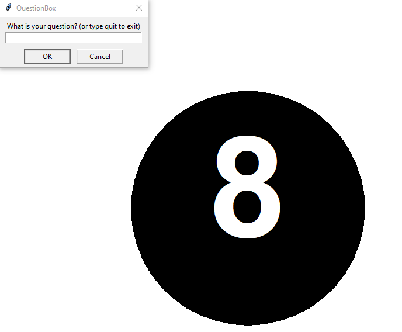

   

Magic 8 Ball
============
In this project we will recreate the [magic 8 ball toy](https://www.magic8ball.org/inside-the-magic-8-ball/) using turtle graphics in Python.
 
For full credit, your finished program should
+ Provide an answer based on user input (e.g. clicking the mouse or typing on the keyboard)
+ Store the answers in a list
+ Use on of Python's `random` functions to choose one answer randomly from the list and display it
+ Use Python's turtle graphics to display a suituable picture
 
Have fun and be creative. Your magic 8 ball app doesn't have to work or look like anyone else's. (Students in the past have used different artwork to create apps like "Ask the magic olive", "Ask Al Gore" or "Ask Bootsy Collins.") 
 
The original Magic 8 Ball toy had 20 answers. You can use these answers or create your own:
+ It is certain
+ It is decidedly so
+ Without a doubt
+ Yes definitely
+ You may rely on it
+ As I see it, yes
+ Most likely
+ Outlook good
+ Yes
+ Signs point to yes
+ Reply hazy try again
+ Ask again later
+ Better not tell you now
+ Cannot predict now
+ Concentrate and ask again
+ Don't count on it
+ My reply is no
+ My sources say no
+ Outlook not so good
+ Very doubtful

Suggested steps to get started
------------------------------
1. You can use the following starter code that draws a black circle
```python
from turtle import *
from random import *
hideturtle()
speed(0)
penup()
goto(0,-175)
pendown()
color(0,0,0)
begin_fill()
circle(175)
end_fill()
done()
```
 


